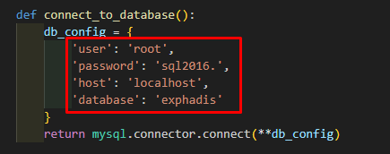
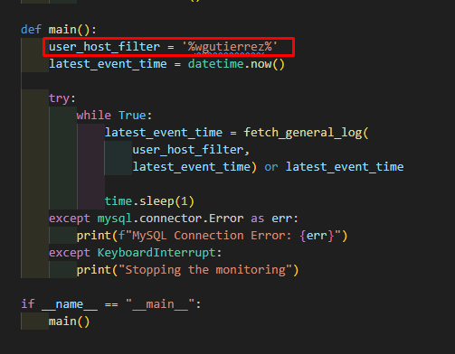
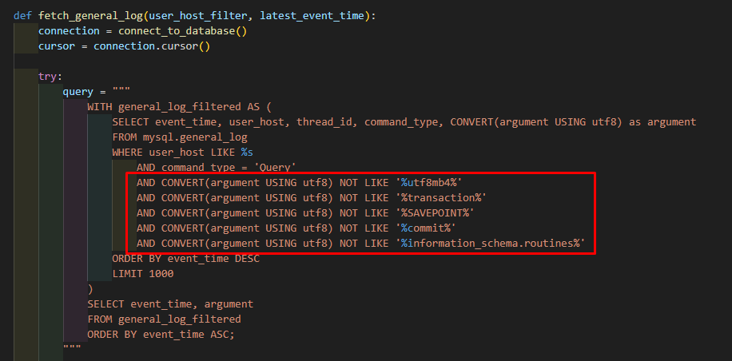
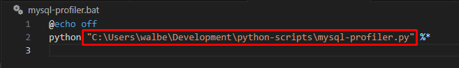

# MySQL PROFILER

## CONSIDERATIONS:
- For a proper way to determine the MySQL user that is executing the queries in the profiler, is recommended to create a specific user for the application.

## DEPENDENCIES
    pip install mysql-connector-python colorama

## PREVIOUS STEPS:
- Configure your MySQL installation to use 'General Logs'

- Change in 'my.ini' in windows or 'my.conf' in linux

    ```
    log-output=TABLE
    general-log=1
    ```

- Execute the following script in your db
    ~~~~sql
    SET @old_log_state = @@global.general_log; 
    SET GLOBAL general_log = 'OFF'; 
    ALTER TABLE mysql.general_log ENGINE = MyISAM; 
    ALTER TABLE mysql.general_log ADD INDEX (event_time); 
    SET GLOBAL general_log = @old_log_state;
    ~~~~

## CONFIGURATIONS:
- Change the connection values in the code
    
    
- Change the custom user configured
    
    
- (Optional) Change the filters if necessary
    

- To deploy, change the .bat file (if is in windows, in linux/mac you may need a .sh) with the correct path where the 'mysql-profiler.py' is located.
    

- FinaLly, add the path where the '.bat' or '.sh' is located to the 'environment variables' o create an alias.